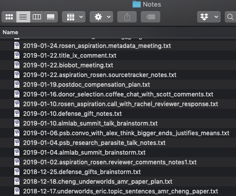
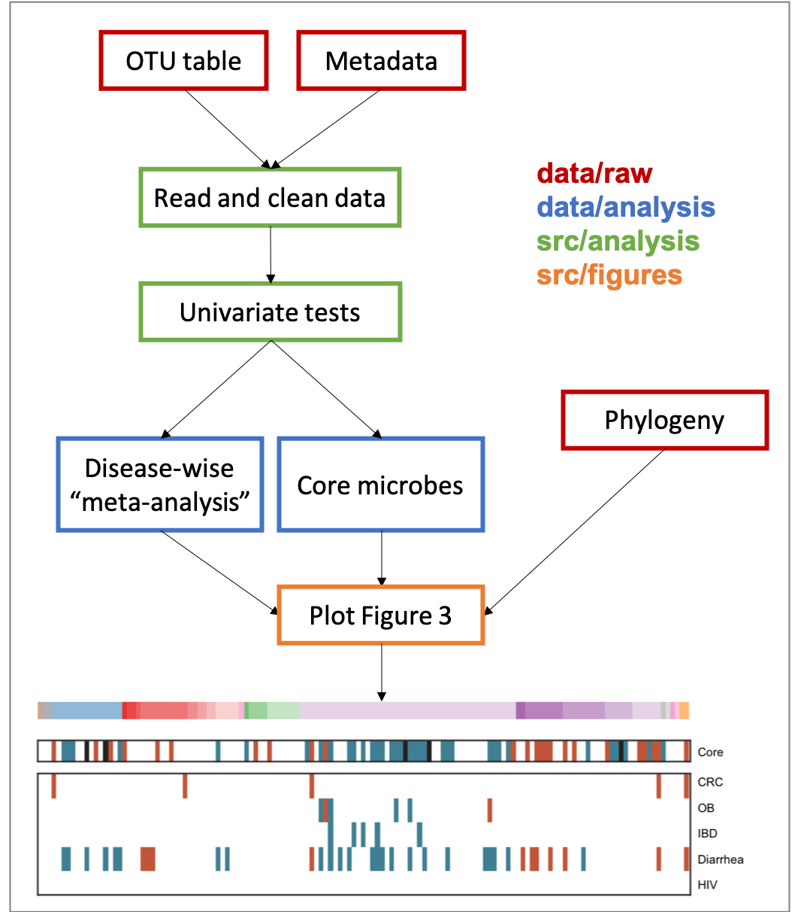

<!-- .slide: data-background="#3F51B5" class="dark" -->

### Tips, tricks, and philosophies on computational work

##### Claire Duvallet

Alm lab summit

February 7, 2019

---


### Why this talk?

- You've already heard my science    
- People say: "zomg how do you do it?"          
- I want to share the gospel of good practices    

---

## 1. Philosophy
## 2. Organization
## 3. Code

---

## 1. Driving philosophies

---

### Philosophy 1

#### Everything I do, I do for me*

_\*future me, that is_

:heart_eyes_cat:

---

#### "What can I do to make future Claire love present Claire?"

- Bread crumbs: READMEs, comments, docs           
- Take notes on everything     
- Label files thoughtfully and searchably    
- Don't put off the small amounts of extra work     

---

If you died in a bus crash tomorrow, how hard would it be to pick up the pieces?

:oncoming_bus:

If your computer dies the week of your defense, how long would it take you to get back up and running?

:scream:

---

### Philosophy 2

Grad school is a time to build skills and _grow_

:deciduous_tree:

---

#### If it would 20% additional effort to be useful to the rest of the world, do it

¯\\\_(ツ)\_/¯

Just seems like the right thing to do...

Note: also my brother tricked me into this one, slash I misinterpreted him.

---

#### What's in it for me?

#### Why am I doing what I'm doing?

I say yes to things that benefited me.

_Learning new skills, making connections, building good favor: all of it counts!_

Note: just make sure you're not doing something for nothing! this talk is an example! I wanted to learn this new presentation style, and write down my reflections on strategies that worked for posterity. Examples: almlab website --> learned xml and css sort of, microbiome club --> got infinite favors from eric

---

## 2. Organization

Projects     
Notes and files      
Data      

---

All of my repos are basically the same structure:

```
├── Makefile           
├── README.md        <- If you don't have a README
|                       did you even make a repo?
|
├── data             <- OTU tables (if small enough),
|                       QIIME 2 outputs, metadata excel
|                       files, trees, etc.
│
├── src              <- All code: scripts, notebooks, etc.
|
└── final            <- Final figures, supp files, tables.

```

---

#### data

```
├── data
    ├── raw          <- Raw data in all of its
    |                   messy glory. NEVER CHANGE!
    |                   Raw data = outputs of processing,
    |                   e.g. original OTU table.
    ├── clean        <- Intermediate data that has
    |                   been cleaned up, e.g. OTU
    |                   table with low QC samples
    |                   removed.
    └── analysis     <- Outputs from analyses (e.g.
                        beta diversity, p-values, etc)
```

Some files will probably be too large to commit: **keep these backed up somewhere else!**

Note: can have other folders here too. Others I've had are qiime2-output, tree, etc. Also look into github large file storage

---

#### src

```
├── src
    ├── data         <- Code used to wrangle and
    |                   clean data.
    |── exploration  <- Jumble of iPython notebooks
    |                   with preliminary work. Label
    |                   these by data + brief description.
    ├── analysis     <- Scripts used to produce files
    |                   in data/analysis/. For the most
    |                   part, Makefile calls these.
    ├── figures      <- Scripts to make figures.
    └── util         <- If you want, files with commonly
                        re-used functions
```

Iterative process between notebooks and scripts.

---

#### final

```
├── final
    ├── figures      <- Where you save final png's,
    |                   also pushed to GitHub if you want.
    |── tables       <- If you're feeling ambitious,
    |                   markdown versions of tables
    └── supp_files   <- Files that would otherwise be
                        supplementary Excel files
```

Mostly for you to organize outputs.

---

Read more at Cookie Cutter data science:

https://drivendata.github.io/cookiecutter-data-science/

---

## Organization

~~Projects~~       
Notes and files      
Data      

---

#### Make all notes and files human-readable and searchable

Anything "messy" starts with a date

Use delimiters creatively

`grep` is your best friend

---

#### There is only one correct way to write the date

# 2019-02-07

Note: That's it. The entire internet agrees with me.

---



---

# Never edit your raw data

---

#### Storing raw data

All data folders should have associated README: who, what, when, why, how?

Google drive and Dropbox are dangerous: who did what when?

---

#### Working with changing data

If files are small enough: version control with github

Otherwise, keep versions ... somehow?

---

## 3. Coding

Makefiles     
Tidy data     

_Implementing these two concepts changed my life_

---

#### Makefiles

```sh
make figure3.png
```



---

#### General idea

```
target: dependencies
    rule
```

To make a `target`, run the `rule` iff any of the `dependencies` are _newer_ than the target.

---

```sh
make figure3.png
```


---

```
figure3.png: src/figure/figure3.py disease_meta.txt \
        core_bugs.txt
    python src/figure/figure3.py \
        --in_meta disease_meta.txt ...

disease_meta.txt: src/analysis/disease_meta.py \
        qvalues.txt
    python src/analysis/disease_meta.py \
        --qvals qvalues.txt \
        --out disease_meta.txt

qvalues.txt: src/analysis/qvalues.py \
        otu.clean meta.clean
    python src/analysis/qvalues.py \
        --otu out.clean --meta meta.clean
```

---

<link href="https://afeld.github.io/emoji-css/emoji.css" rel="stylesheet">

#### But why?

zomg reviewer comments zomg

<i class="em em-exploding_head"></i>

#### Also:

The code _is_ the documentation of what you did.

It makes future you love current you. :heart_eyes_cat:

Note: give example, latest paper wanted alpha diversity, which I had done but commented out. Now I know exactly what script to run and what inputs it requires.

---

<link href="https://afeld.github.io/emoji-css/emoji.css" rel="stylesheet">

#### Tidy data

Literally life-changing.

:panda_face: + <i class="em em-exploding_head"></i> = :nerd: :mortar_board:

---

#### The idea is that each unique observation gets its own line

Tidyfied OTU table:

```
otu_id  sample_id   counts
otu1    s1          0.0
otu1    s2          16.0
otu1    s3          0.0
...     ...         ...
otu2    s1          1.0
otu2    s2          0.0
otu2    s3          20.0
```

---

#### But why?

Query subsets of data

Merge data

Harness seaborn

_Just trust me_
_(and Nathaniel and the #Rstats internet!)_

---

## Thanks for listening!


Note: source = https://nightowlmom2.wordpress.com/category/soapbox/

---


---

Note:```
├── LICENSE
├── Makefile           
├── README.md        <- If you don't have a README did you even make a repo?
|
├── data
│   ├── raw          <- Raw data in all of its messy glory. NEVER CHANGE!
│   ├── clean        <- Intermediate data that has been cleaned up
│   └── analysis     <- Outputs from analyses (e.g. beta diversity, p-values, etc)
│
├── src
│   ├── data         <- Code used to wrangle and clean data.
|   |── exploration  <- Jumble of iPython notebooks with preliminary work
│   ├── analysis     <- Scripts used to produce files in data/analysis
│   └── util         <- If you want, files with commonly re-used functions
|
├── final
    ├── figures      <- Place where final png's get saved, also pushed to GitHub.
    |── tables       <- If you're feeling ambitious, markdown versions of tables
    └── supp_files   <- Files that would otherwise be supplementary Excel files

```

---
